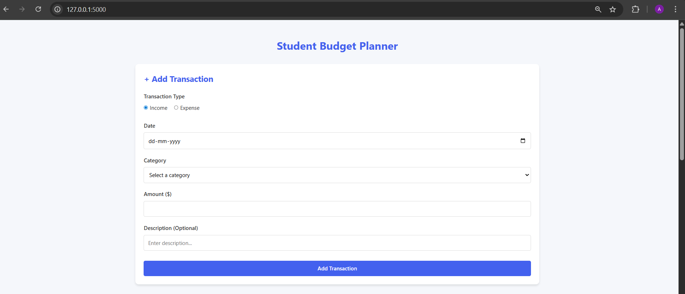
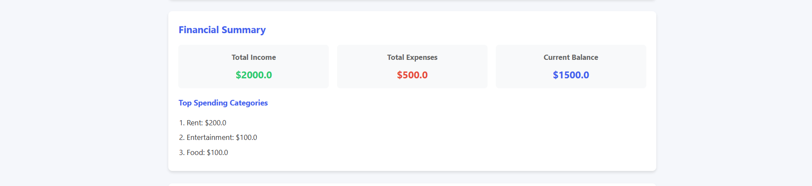
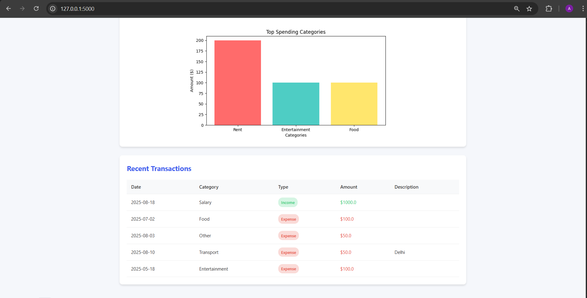

# Student Budget Planning App 💰

A simple **Budget Planning App for Students** built with Python.  
This project helps students manage their monthly income and expenses effectively.
this project is deploy on render the link of render is below the local server link

---

## 🚀 Features
- Add income and expense transactions  
- Categorize spending (Food, Travel, Rent, etc.)  
- Dashboard with spending visualization  
- Recent transactions list  
- Final summary report  

---

## 📂 Project Structure
```
Student-Budget-Planning-App/
│-- app.py
│-- requirements.txt
│-- index.html
│-- style.css
│-- templates/
│-- static/
│-- screenshots/
```

---

## 🖼 Screenshots

### Dashboard


### Final Summary


### Recent Transactions


### Spending Visualization


---

## ⚙️ Installation & Setup

1. Clone this repository:
   ```bash
   git clone https://github.com/YOUR-USERNAME/Student-Budget-Planning-App.git
   ```

2. Navigate into the project:
   ```bash
   cd Student-Budget-Planning-App
   ```

3. Create a virtual environment:
   ```bash
   python -m venv myenv
   ```

4. Activate the environment:  
   - Windows (PowerShell):
     ```bash
     myenv\Scripts\activate
     ```
   - Mac/Linux:
     ```bash
     source myenv/bin/activate
     ```

5. Install dependencies:
   ```bash
   pip install -r requirements.txt
   ```

---

## ▶️ Run the App
```bash
python app.py
```

Then open `http://127.0.0.1:5000/` in your browser.
https://student-budget-planner-apps.onrender.com/

---

## 📜 License
This project is open-source and free to use.  

---

## ⭐ Contribution
If you like this project, consider giving it a star ⭐ on GitHub!

